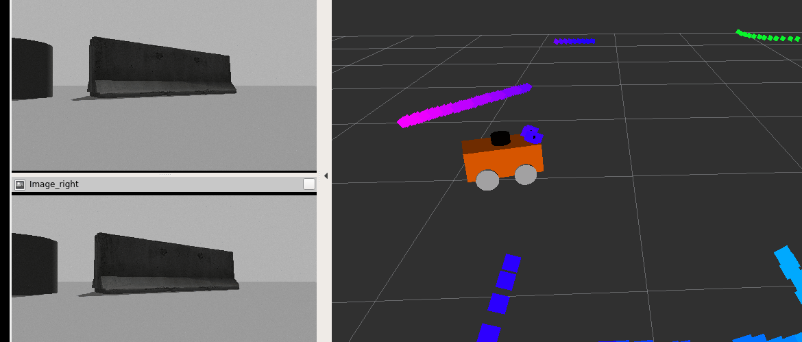

# mobile-robot-sim

---

## Dependencies

* [ubuntu](https://www.ubuntu.com/download/desktop).
* [ROS Kinetic](http://wiki.ros.org/kinetic/Installation/Ubuntu) if you have Ubuntu 16.04.

## Cloning

Clone the project repository: `git clone https://github.com/suljaxm/mobile-robot-sim.git`

## Compiling and Running

### Compiling
```
cd mobile-robot-sim/src
catkin_init_workspace
cd ..
catkin_make
```

### Running

1. Multi-sensor car
```
source mobile-robot-sim/devel/setup.bash
roslaunch mbot_gazebo view_mbot_with_sensor_gazebo_automobile.launch 
```

<div align=center></div>

