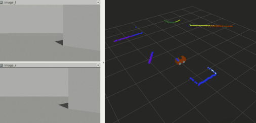
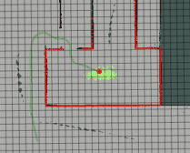
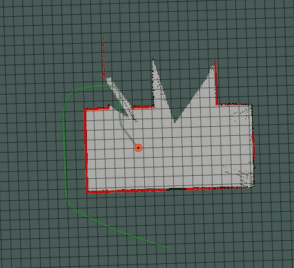

# mobile-robot-sim

---

## Dependencies

* [ubuntu](https://www.ubuntu.com/download/desktop).
* [ROS Kinetic](http://wiki.ros.org/kinetic/Installation/Ubuntu) if you have Ubuntu 16.04.

## Cloning

Clone the project repository: `git clone https://github.com/suljaxm/mobile-robot-sim.git`

## TODO
- [x] keyboard control
- [x] voice control
- [ ] object detection
- [ ] virtual binocular calibration
- [x] two wheeled robot navigation
- [ ] four wheeled robot navigation


## Compiling and Running

### Compiling

```
cd mobile-robot-sim/src
catkin_init_workspace
cd ..
catkin_make
```

### Running
First we need to set up the environment before we can run the modules.
```
source mobile-robot-sim/devel/setup.bash
```


- **Multi-Sensor Car**
```
roslaunch mbot_gazebo view_mbot_with_sensor_gazebo_automobile.launch 
```

<div align=center></div>

- **Voice-Control Car**
	- start car simulation
	```
	roslaunch mbot_gazebo view_mbot_gazebo_empty_world_automobile.launch 
	```
	- start the voice control node
	```
	roslaunch robot_voice voice_control_automobile.launch 
	```
	- wake up the voice-control node
	```
	rostopic pub /voiceWakeup std_msgs/String "data: '1'" 
	```

- **SLAM**
	- start car simulation
	```
	roslaunch mbot_gazebo mbot_laser_nav_gazebo_automobile.launch
	```
	- start the slam node
	```
	roslaunch mbot_navigation gmapping_demo.launch
	```
	
-  **Navigation**
	- start sweeping robot simulation
	```
	roslaunch mbot_gazebo mbot_laser_nav_gazebo_sweep.launch
	```
	- load map
	```
	roslaunch mbot_navigation nav_maze_demo.launch 
	```
	- set navigation goal
	```
	rosrun mbot_navigation move_test.py
	```
	<div align=center></div>

- **SLAM && Navigation**
	- start sweeping robot simulation
	```
	roslaunch mbot_gazebo mbot_laser_nav_gazebo_sweep.launch
	```
	- start the navigation node
	```
	roslaunch mbot_navigation exploring_slam_demo.launch
	```
	- set navigation goals
	```
	rosrun mbot_navigation exploring_random.py 
	```
	<div align=center></div>
